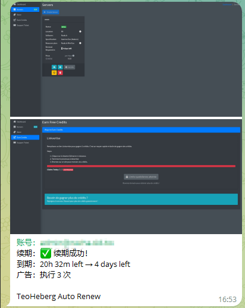

# TeoHeberg 自动化工具集

> 两种实现，覆盖续期与每日广告任务，任选其一或搭配使用，让你的免费主机永不过期。

本仓库提供两套独立运行的自动化方案：

1. **Python 自动续期脚本** – 基于 Playwright 模拟浏览器，自动登录、识别验证码、续期，并完成广告任务，适合部署在 GitHub Actions。  
2. **Cloudflare Workers 广告任务自动化** – 轻量级无服务器实现，专注于每日广告积分，支持多账号管理、Web 管理面板和 API 触发。

以下分别说明。

---

## 方案一：Python 自动续期脚本（Playwright + GitHub Actions）

### 功能亮点

- 🔐 **自动登录** – 使用环境变量中的邮箱/密码，完成登录全流程。  
- ♻️ **智能续期** – 解析服务器到期时间，剩余不足 2 天时自动执行续期（含第二次验证码）。  
- 🧠 **reCAPTCHA 音频破解** – 自动切换至音频挑战，下载 MP3 并用语音识别完成验证，无需第三方打码服务。  
- 🪙 **广告积分获取** – 直接提取 Linkvertise 最终链接，绕过等待页，循环执行直到当日额度用完。  
- 📬 **Telegram 通知** – 将续期结果、积分变化、截图实时推送到你的 Telegram。

### 环境要求

- Python 3.11+
- Playwright (Chromium)
- 系统依赖：`xvfb`, `ffmpeg`, `libgl1-mesa-glx` 等（在 GitHub Actions 中自动安装）

### 本地运行

1. **克隆仓库，安装依赖**

   ```bash
   sudo apt install xvfb ffmpeg libgl1-mesa-glx   # 仅 Linux 需要
   pip install -r requirements.txt                 # playwright requests SpeechRecognition pydub
   python -m playwright install --with-deps chromium
   ```

2. **设置环境变量**

   ```bash
   export TEOHEBERG="你的邮箱-----你的密码"
   # 可选 Telegram
   export TG_BOT_TOKEN="123456:ABC-DEF"
   export TG_CHAT_ID="123456789"
   ```

3. **运行脚本**

   ```bash
   python scripts/main.py
   ```

   截图默认保存在 `screenshots/` 目录。

### GitHub Actions 部署

1. 将代码推送至 GitHub 仓库。  
2. 在仓库 Settings → Secrets and variables → Actions 中添加以下 Secret：

   | Secret 名称 | 说明 | 必填 |
   |------------|------|------|
   | `TEOHEBERG` | 账号信息，格式：`邮箱-----密码` | ✅ |
   | `TG_BOT_TOKEN` | Telegram Bot Token | ❌ |
   | `TG_CHAT_ID` | 接收通知的 Chat ID | ❌ |

3. 工作流文件已包含（位于 `.github/workflows/teoheberg-renew.yml`），默认 cron 为北京时间每天 08:28。  
   - 手动触发：Actions → “TeoHeberg 续期” → Run workflow。
  
> 📌 通知：

#### 工作流核心步骤概览

- 检出代码，安装 Python 3.11 及系统依赖（xvfb、ffmpeg 等）。  
- 启用 Cloudflare WARP（通过 `fscarmen/warp-on-actions`）以规避 reCAPTCHA IP 封锁。  
- 配置 DNS 并等待 WARP 就绪。  
- 在虚拟显示（`xvfb-run`）下执行 `python scripts/main.py`。  
- 自动清理旧的工作流运行记录。

> ⏳ 超时时间：30 分钟，可根据需要调整。

### 脚本执行流程图

1. 登录 → reCAPTCHA 音频破解 → 进入管理面板  
2. 检查服务器到期时间：  
   - 剩余 ≥ 2 天 → 跳过续期  
   - 剩余 < 2 天 → 点击 Renew → 再次破解 reCAPTCHA → 确认续期  
3. 循环点击 “Earn Credits” → 获取 Linkvertise 链接 → 直接访问目标 URL → 等待返回，直至出现 `Limite quotidienne atteinte`  
4. 汇总结果并发送 Telegram 通知（含截图）

---

## 方案二：Cloudflare Workers 广告任务自动化

> ⚡ 轻量、零运维，专注于每日广告积分，支持多账号管理和前端面板。

### 功能说明

- ✅ **自动完成每日广告任务** – 模拟请求，直接解析 Linkvertise 并完成验证。  
- ✅ **多账号批量管理** – 支持添加、删除、Cookie 手动更新。  
- ✅ **积分追踪与通知** – 对比前后积分差值，Telegram 推送完成次数和积分变化。  
- ✅ **智能冷却机制** – 广告成功后冷却 24.5 小时；一个账号额度用完时短暂冷却 2 小时。  
- ✅ **管理面板** – 网页 UI 可视化管理所有账号，显示冷却状态，手动执行单个或全部可用账号。  
- ✅ **完整 API** – 可通过 HTTP 触发单个/全部账号，便于集成。

### 注意事项

> ❗ 本方案依赖已登录的长期 Cookie（`remember_web`），**不提供自动登录**。你需要手动获取并填写。  
> ❗ 登录时务必勾选 **“Se souvenir de moi”**（记住我），以获取长期有效 Cookie。

### 部署方式（Cloudflare Workers）

1. 登录 [Cloudflare Dashboard](https://dash.cloudflare.com/)，进入 Workers 页面  
2. 创建一个新的 Worker，将 [worker.js](./worker.js) 代码粘贴进去  
3. 创建 **KV 命名空间**（名称随意），在 Worker 设置中绑定变量名为 `TEOHEBERG_KV`  
4. 配置环境变量（见下表）  
5. 部署 Worker  

   | 变量名 | KV 命名空间 |
   |--------|------------|
   | `TEOHEBERG_KV` | 你创建的 KV |

4. 在 Worker 设置 → Variables → Environment Variables 中添加：

   | 变量名 | 说明 | 必填 |
   |--------|------|------|
   | `AUTH_KEY` | 访问密钥（保护面板和 API） | ✅ |
   | `TELEGRAM_BOT_TOKEN` | Telegram Bot Token | ❌ |
   | `TELEGRAM_CHAT_ID` | 接收通知的 Chat ID | ❌ |

5. 部署 Worker。

### 如何获取长期 Cookie

1. 打开浏览器，**F12** 打开开发者工具，切换到 **Network**（网络）标签。  
2. 访问 `https://manager.teoheberg.fr` 并登录（**务必勾选“Se souvenir de moi”**）。  
3. 在 Network 中找到名为 `login` 的请求，点击它，在 **Request Headers** 中找到 `Cookie:` 行。  
4. 复制以 `remember_web_` 开头的整个值，例如：  

   ```
   remember_web_59ba3xxx89d=eyJpdiI6xxxiIn0%3D
   ```

5. 按照以下格式添加到管理面板（每行一个账号）：

   ```
   邮箱或备注-----remember_web_59ba3xxx89d=eyJpdiI6xxxiIn0%3D
   ```

   中间为 **5 个短横线**。

> 📌 图片参考：
> 📌 图片参考：

### 定时触发

在 Worker 的 **Triggers** 中添加 Cron 触发器，推荐每 5 分钟一次：

```
*/5 * * * *
```

每次执行仅处理 **1 个**可执行账号（冷却已过的），完全不会触发免费计划限制。

### 使用方式

#### 1. 管理面板

直接访问 Worker 域名，输入你设置的 `AUTH_KEY` 即可进入：

- 查看账号列表、冷却状态、可执行数量  
- 批量添加 / 删除账号  
- 手动执行单个账号（可强制忽略冷却）  
- 手动执行所有可用账号  
- 弹窗更新 Cookie

#### 2. API 接口

**执行单个账号**（可带 `force=true` 强制忽略冷却）：
```bash
curl "https://你的域名/run?email=admin@example.com&key=AUTH_KEY&force=true"
```

**执行所有可用账号**（自动跳过冷却，每次仅处理一个）：
```bash
curl "https://你的域名/run-all?key=AUTH_KEY"
```

**查看账号列表**：
```bash
curl "https://你的域名/accounts?key=AUTH_KEY"
```

### Telegram 通知示例

**任务完成**：
```
✅ 广告任务已完成

账号：admin@example.com
积分：0,00 -> 6,00
广告：完成 3 次
下次执行：2026/5/5 12:30:00

TeoHeberg Daily Points
```

**额度用完（冷却中）**：
```
⏳ 冷却中

账号：admin@example.com
积分：6,00
广告：今日额度已用完

TeoHeberg Daily Points
```

**Cookie 失效**：
```
🚨 Cookie 已失效

账号：admin@example.com
状态：remember_web 已失效，需要手动更新
⚠️ 请尽快手动更新长期 Cookie

TeoHeberg Daily Points
```

---

## 共同部分

### Telegram 通知配置

两种方案共用同一个 Telegram Bot，只需在同一 Secret / 环境变量中填入：

- `TG_BOT_TOKEN` / `TELEGRAM_BOT_TOKEN`：通过 [@BotFather](https://t.me/BotFather) 创建  
- `TG_CHAT_ID` / `TELEGRAM_CHAT_ID`：你的用户或群组 ID（可通过 [@userinfobot](https://t.me/userinfobot) 获取）

未配置 Telegram 将不会发送通知，脚本 / Worker 仍会正常运行。

### 常见问题

**Q：可以同时使用两种方案吗？**  
A：可以，但请注意 Cloudflare Workers 方案只负责广告积分（不包含续期），而 Python 方案同时包含续期和积分。建议只选一种广告积分实现，避免重复操作。

**Q：reCAPTCHA 音频识别失败率高怎么办？**  
A：Python 方案内置重试机制（最多 8 次），并且使用 WARP 更换出口 IP。如果频繁失败，可能是语音识别模型问题，可考虑换用其他识别引擎。

**Q：Workers 方案需要 Cookie，多久失效？**  
A：勾选“记住我”后 Cookie 一般可长期有效（数周至数月），一旦失效你会收到 Telegram 通知，只需重新获取并更新即可。

**Q：免费 Workers 每日请求限制是多少？**  
A：免费计划每日 10 万请求。本方案每次触发仅消耗极少请求，完全在额度内。

---

## 免责声明

本工具仅供学习和自动化个人合法服务使用。请遵守 TeoHeberg 的服务条款，切勿用于商业或滥用目的。因使用本脚本/Worker 产生的任何问题，作者不承担任何责任。

---

## 许可证

MIT License

---

**如果这个项目对你有帮助，请点个 Star ⭐ 支持！**
